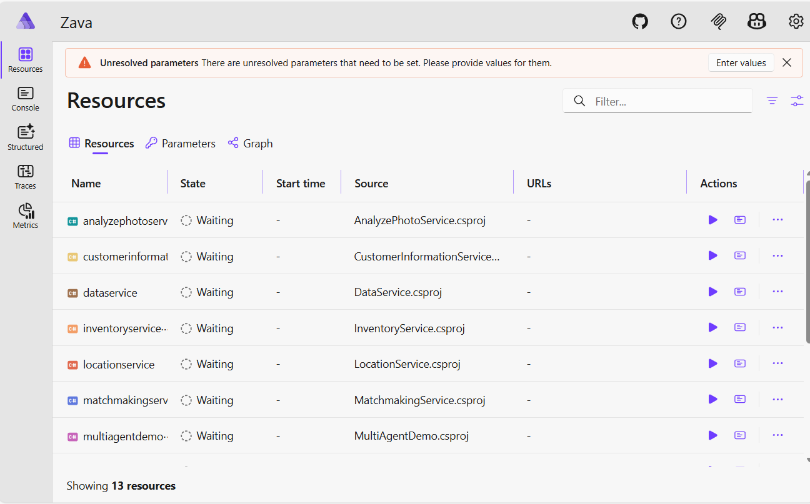

# STEP 01 — Prepare your environment

> Note: This document has been split into three focused documents to make it easier to find the information you need:

> - `Prerequisites.md` — tooling, SDKs, and access requirements (see `./Prerequisites.md`).
> - `02.NeededCloudResources.md` — cloud resource setup and AI Foundry guidance (see `./02.NeededCloudResources.md`).
> - `HowToRunDemoLocally.md` — step-by-step local build and run instructions, secrets, and smoke-test commands (see `./HowToRunDemoLocally.md`).

The original content remains below for historical reference.

## Summary

This document provides a concise installation and architecture overview for the `aspiredemo` solution (Zava-Aspire). It covers required tooling, a short description of the solution architecture, minimal local run instructions, and the key configuration points needed to run the demo.

---

## Prerequisites

- .NET SDK 9.x (verify with `dotnet --info` or `dotnet --list-sdks`) ([Download .NET](https://dotnet.microsoft.com/en-us/download))
- Visual Studio 2022 (recommended 17.14.13+) or Visual Studio Code with C#/.NET extensions
- Docker Desktop (required only for containerized runs)
- Azure subscription (required only if you plan to deploy to Azure or use Microsoft Foundry)
- Azure CLI (`az`) and optionally Azure Developer CLI (`azd`) if you plan to use `azure.yaml`/`azd` for provisioning
- Git

Notes:

- The solution is cross-platform — it runs on Windows, macOS, and Linux.

---

## Architecture (aspiredemo) — brief

- ZavaAppHost: the application host / orchestrator that composes local microservices and binds Azure resources when publishing.
- Microservices (examples):
  - `Products` — product catalog (with SQL Server back end)
  - `Store` — demo front-end that aggregates other services
  - `AgentsCatalogService`, `AnalyzePhotoService`, `CustomerInformationService`, `InventoryService`, `LocationService`, `MatchmakingService`,  `NavigationService`, `ProductSearchService`, `ToolReasoningService`
  - `SingleAgentDemo` and `MultiAgentDemo` (demo scenarios)
- Shared layers: `Shared`, `DataEntities`, `SearchEntities`, `VectorEntities`, `CartEntities`
- AI agents: Agent definitions and configurations are managed in Microsoft Foundry. Services call agents by ID; runtime configuration uses `aifoundry`/`aifoundryproject` keys.
- Infra: `./infra` contains a console application that will automatically deploy the agents once the Microsoft Foundry Hub is created, and the base models are deployed.

See `aspiredemo/ZavaAppHost/Program.cs` for the service composition and the configuration keys consumed at runtime.

---

## Necessary Cloud Resources needed for local run

Before running the demo locally you must provision a small set of cloud resources one time only; see the detailed guide here: [02 — Needed Cloud Resources](./02.NeededCloudResources.md). These resources (Microsoft Foundry project, model deployments, agent deployments, and any required search/index or storage connections) are required for the agents and demo services to work when run locally.

## Running in Terminal

Open PowerShell / Bash in this folder (`aspiredemo`) or navigate to the solution folder and run:

```powershell
# Restore dependencies
dotnet restore Zava-Aspire.slnx

# Build the solution
dotnet build Zava-Aspire.slnx

# Trust local dev certs for HTTPS
dotnet dev-certs https --trust

# Run 
dotnet run --project ./ZavaAppHost/ZavaAppHost.csproj
```

## Running in Visual Studio

1. Open `aspiredemo\Zava-Aspire.slnx` in Visual Studio.
2. In Solution Explorer, right-click the project '1 Aspire/ZavaAppHost' to run and select `Set as Startup Project`.
3. Press F5 to run (or Ctrl+F5 to run without debugging).

## Running in Visual Studio Code / Visual Studio Code Insiders

1. Open `aspiredemo` folder in Visual Studio Code / Visual Studio Code Insiders.
2. In Solution Explorer, right-click the project '1 Aspire/ZavaAppHost' to run and select `Set as Startup Project`.
3. Right-Click '1 Aspire/ZavaAppHost', Select 'Debug' -> 'Start New Instance'

The console will display the listening URL(s) (for example `https://localhost:17104/login?t=7040c2fb1bad0ebe1a467bd1ad076f5e`). Open the indicated URL in your browser to access the demo UI.

## 1st Run set secrets

The first time running the solution, the .NET Aspire dashboard will require you to set up the necessary secrets for accessing Azure resources.



Complete the values in the form, where:

- `aifoundry` is the connection string: `Endpoint=https://<your-resource>.cognitiveservices.azure.com/;ApiKey=<your-api-key>`
- `applicationinsights` is the Application Insights connection string from your Application Insights resource
- 'aifoundruyproject' is the Project endpoint URL from your AI Foundry project settings page
- `customerinformationagentid`, `inventoryagentid` and all the other agent ids, are the agent IDs you created in the previous step; see [02 — Needed Cloud Resources](./02.NeededCloudResources.md) for details.

- check the `Save to user secrets` box to save them in your user secrets project for future runs.


---
